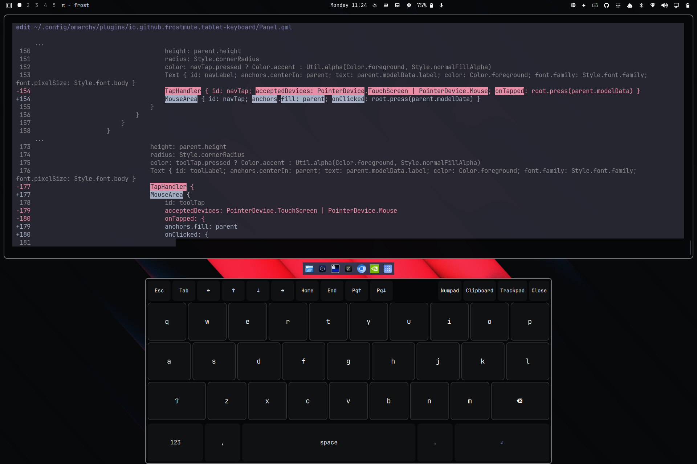

# Omaqwerty for Omarchy



**Omaqwerty** is a touch-first on-screen keyboard for Omarchy tablets. It combines a docked mode that reserves screen space with a free-floating mode that can be dragged anywhere on screen. It is part of the optional **Omablet** suite but installs and runs independently.

---

## Features

### Movable, Draggable & Dynamic Docking
- **Docked Mode (Screen Space Reserved)**: When docked at the bottom of the screen, Omaqwerty sets an exclusive zone in Hyprland so tiled windows are constrained above the keyboard and never obscured.
- **Floating Mode (Screen Space Released)**: The moment you touch or drag the keyboard away from the dock, it automatically releases its reserved space—letting application windows expand all the way to the bottom edge of the screen—while the keyboard floats on top.
- **Multiple Docking Controls**:
  - **Drag to Undock**: Touch or click the top grab bar and move the keyboard anywhere on screen.
  - **Snap to Dock**: Drag the keyboard down towards the bottom center of the display to snap it back into the dock.
  - **Double-Tap**: Double-tap or double-click the top drag bar to quickly toggle between docked and floating positions.
  - **Dock / Float Button**: Tap **Float** in the header to undock with one tap, or tap **Dock** to dock it back immediately.

### Resizable & Touch-Safe Layout
- **Dynamic Drag Resizing**: Freely resize the keyboard by dragging any of the 4 corner handles or 4 border edges. A visual diagonal dot grip indicator in the bottom-right corner provides immediate touch affordance. Resizing works seamlessly in both floating and docked modes (dynamically expanding or contracting Hyprland's reserved exclusive zone when docked).
- **Usability Constraints**: Built-in minimum width and height boundaries ensure keys never shrink below ergonomic touch-target standards (~40–48px), preventing missed taps and fat-finger errors even on compact screens.
- **Orientation-Aware Sizing**: Separate size bounds and custom dimensions are maintained for landscape and portrait tablet orientations, automatically adapting when the tablet rotates.
- **Selectable Size Presets (S, M, L, Full)**: Tap the **Size** button in the header to open a quick-select popover with one-tap presets:
  - **S (Compact)**: Minimal footprint, ideal for one-handed thumb typing or leaving maximum screen space visible for code and terminals.
  - **M (Standard)**: Balanced two-handed typing layout (default).
  - **L (Large)**: Expanded, spacious layout with oversized keys for high-accuracy typing on large tablets.
  - **Full (Max Width)**: Fills the entire screen width when docked for edge-to-edge tablet typing.
  - **Quick Cycle**: Double-tap the Size button to instantly cycle between presets (`S` → `M` → `L` → `Full`).
  - **Reset Button**: One-tap "Reset to default size" button appears inside the Size menu when the keyboard is in a custom drag-resized state.
- **Pinned Tool Bar & Scrollable Navigation**: The tools bar (Numpad, Clipboard, Trackpad, Size, Dock/Float, Close) remains firmly anchored to the right side at all times. If the keyboard is resized narrower, the navigation strip scrolls smoothly horizontally via flickable touch.
- **Live Dimension Indicator**: Real-time width × height display in the drag bar and Size popover.
- **Responsive Typography & Key Proportions**: Key labels, caps indicators, modifier badges, and header buttons dynamically scale with the keyboard dimensions so fonts never clip or feel oversized.
- **Persistent Preferences**: Size preset, custom dimensions, floating position, and docked state are automatically saved to `~/.config/omarchy/omaqwerty.json` and restored across shell restarts and reboots.

### Full Standard QWERTY Modifiers
- **Ctrl, Fn, Super/Cmd, and Alt**: Present directly on the bottom row across all keyboard layouts (letters, numbers, symbols, and numpad).
- **Single-Tap Latch**: Tap a modifier once to highlight it and arm it for the next keypress (e.g. tap **Ctrl** then **c** to send `Ctrl+C`). It automatically disarms after the keystroke.
- **Double-Tap Sticky Lock**: Double-tap any modifier to lock it in place (indicated by an active highlight and `LOCK` badge) for repeated shortcuts or navigation. Tap again to release.
- **Chords & Multi-Modifier Combos**: Fully supports multi-key combinations such as `Ctrl + Shift + Esc`, `Super + Shift + Q`, `Ctrl + Alt + Del`, `Alt + Tab`, and `Super + Return`.

### Function Row & Fn Mode
- **Dynamic Function Row**: Tap **Fn** to transform the top navigation strip into function keys: **F1 through F12**, **PrtSc** (Print Screen), **Ins** (Insert), and **Del** (Delete).
- **Numeric Shortcuts**: While **Fn** is active, tapping number keys `1`–`0` dispatches **F1** through **F10**.
- Double-tap **Fn** to lock function mode on.

### Shift & Caps Lock
- **Shift**: Tap once to capitalize the next letter or access shifted symbols.
- **Caps Lock**: Double-tap **Shift** to lock uppercase entry (indicated by `⇪ CAPS`). Tap once more to unlock.
- **Shifted Symbols**: When Shift is active on the numbers layout, numbers dynamically transform to their shifted counterparts (`!@#$%^&*()`).

### Complete Navigation & Touch Numpad
- **Navigation Row**: Dedicated keys for **Esc**, **Tab**, **Del** (Delete), arrow keys (**←**, **↑**, **↓**, **→**), **Home**, **End**, **Pg↑**, and **Pg↓**.
- **Touch Numpad**: Large 3-column numpad for rapid numeric data entry.
- **Symbols**: Multi-page symbol keyboards containing brackets (`[]`, `{}`), slashes, math symbols, currency signs, and backtick (`` ` ``).

### Companion Integrations
- **Clipboard**: One-tap launcher for the Omarchy clipboard overlay.
- **Omaglide**: One-tap toggle for the Omaglide on-screen trackpad.

---

## Omablet Suite

Omaqwerty is part of the optional Omablet tablet experience:
- [Omablet](https://github.com/frostmute/omarchy-omablet) — Tablet-mode rotation and desktop controls.
- [Omaglide](https://github.com/frostmute/omarchy-omaglide) — Floating touch trackpad with mouse emulation.

---

## Install

```sh
omarchy plugin add https://github.com/frostmute/omarchy-omaqwerty.git --enable
```

Requires `wtype` for Wayland keyboard injection:

```sh
omarchy pkg add wtype
```

## Remove

```sh
omarchy plugin remove io.github.frostmute.tablet-keyboard
```

## License

MIT
